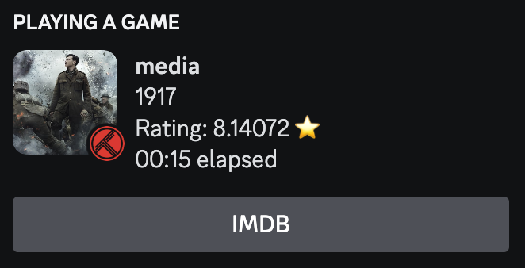
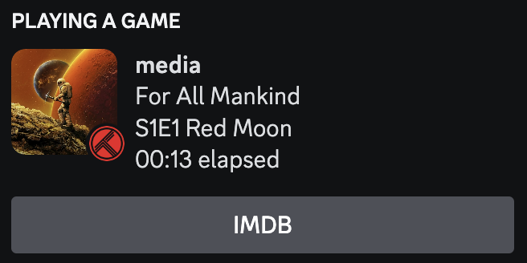

# PyDiscTrakt

## A Python app for syncing Trakt with Discord Rich Presence

This is basically [Discrakt](https://github.com/afonsojramos/discrakt) but with Python. Go check out their README if you want more detailed instructions.

### How to install?

Go to releases and download either pydisctrakt.exe if you are running Windows or pydisctrakt if you are running MacOS or Linux.

Also download the config.ini file regardless of which operating system you are using. Put this file in the <u>same folder</u> as the other file you just downloaded.

On Windows, simply run the .exe file.

On Mac, <u>you must make the file executable by running</u> `chmod +x pydisctrakt` in a terminal. Then you can run the program.

### Setup instructions

Just follow the instructions in the program!

If at any point you make a mistake and want to start over, go in the config.ini file and delete the credentials.

The script <b>must be running on the same machine as Discord is installed on</b>!
